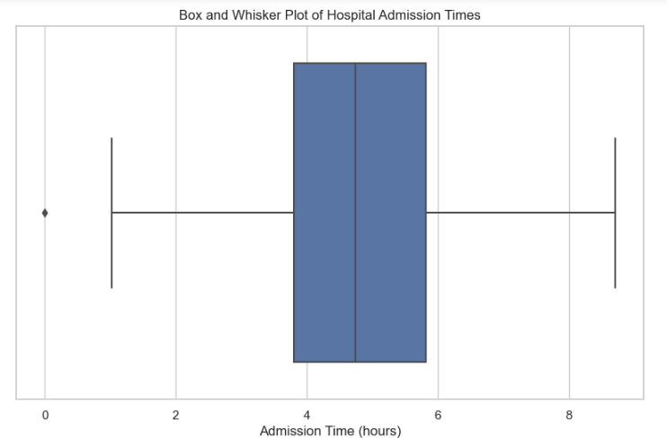

# Project9-STM-Hospital-Admission-Time
> **Brief Description:** To analyze the distribution of hospital admission times in a healthcare facility to understand the spread and central tendency of the data.

---

## Table of Contents

- [Description](#description)
- [Video Explanation](#video)
- [Technologies Used](#technologies-used)
- [Dataset](#dataset)
- [Program Codes ](#program-codes)
- [Screenshots](#screenshots)
- [Contribution](#contributipn)
- [Contact Details](#contact-details)

---

## Description

To analyze the distribution of hospital admission times in a healthcare facility to understand the spread and central tendency of the data.

**Here we want to know**

-  How long it takes to admit majority of patients after they arrive at the hospital?
-  On average, what is the typical amount of time taken to admit them?
-  How much time a complicated case may take to admit?

## Video
<!--
 
-->

We are working on this section. Please check at some other time.

## Technologies-used

Python programming language, pandas and matplotlib package.

## Dataset

The data set is synthetically generated and used for demonstrating the concept only. The program can be easily modified to show results with real readings taken from the patients.

## Program-codes

The programs are written on jupiter notebook, You may run the program on Google colab by clicking on the colab badge below.

## Screenshots

The program generates and plots a box and whisker plot to illustrate the distribution of hospital admission times. Here's what the plot communicates in layman's terms:

### Plot Overview:
1. **Box and Whisker Plot**:
   - This type of plot shows the distribution of data based on a five-number summary: minimum, first quartile (Q1), median, third quartile (Q3), and maximum.

### Key Points:
1. **Admission Time (hours)**:
   - The x-axis represents the time it takes for hospital admissions in hours.
   - Each point in the plot represents a recorded admission time.

2. **Box Plot Components**:
   - **Box**: The main part of the plot represents the interquartile range (IQR), which contains the middle 50% of the data.
     - The left edge of the box is the first quartile (Q1), where 25% of the data points are below this value.
     - The right edge of the box is the third quartile (Q3), where 75% of the data points are below this value.
   - **Median Line**: A line inside the box represents the median (middle value) of the data.
   - **Whiskers**: Lines extending from the box to the smallest and largest values within 1.5 times the IQR from the lower and upper quartiles.
   - **Outliers**: Individual points outside the whiskers represent outliers, indicating unusually short or long admission times compared to the rest of the data.

### Interpretation:
- **Distribution of Admission Times**:
  - The box plot provides a visual summary of the distribution of hospital admission times.
  - Most admission times are concentrated within the interquartile range (the box).
  - The median line shows the central tendency of the admission times.
  - Whiskers show the overall range of most data points, while outliers highlight unusually high or low admission times.

### In Layman's Terms:
The plot visually explains the distribution of hospital admission times. Here's what each part means:

- **Box**: The central part of the plot shows where most of the admission times fall.
- **Median Line**: The line in the middle of the box shows the average admission time.
- **Whiskers**: The lines extending from the box show the range of admission times, except for any extreme values.
- **Outliers**: The individual points outside the whiskers are the unusual admission times that are much shorter or longer than the rest.

This plot helps to understand how long hospital admissions typically take, where most times fall, and if there are any unusual admission times.

## Contribution

The programs are written by Santanu Karmakar

## Contact-details

If you wish to contact me, please leave a message (Preferably WhatsApp) on this number: 6291 894 897.
Please also mention why you are contacting me. Include your name and necessary details.
Thank you for taking an interest.
